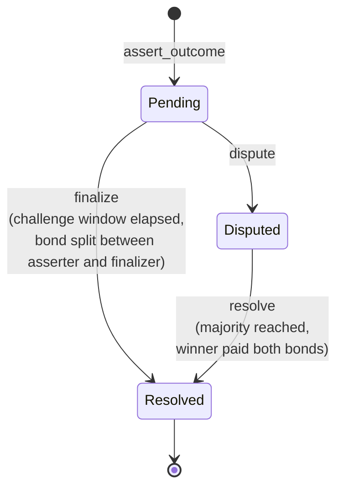

# Contract interface

Reference for `contracts/tholos`. Source of truth is `contracts/tholos/src/lib.rs`; this
document should be updated alongside any change to the public interface.

## Lifecycle



Every assertion ends in `Resolved`, reached one of two ways: uncontested (`finalize`
after the challenge window with no dispute) or contested (`resolve` once a majority
of the resolver committee agrees on one side).

## Types

### `Status`

State of an assertion: `Pending`, `Disputed`, or `Resolved`.

### `Assertion`

| Field | Type | Meaning |
| --- | --- | --- |
| `asserter` | `Address` | Who posted the claim |
| `outcome` | `bool` | The claimed outcome |
| `final_outcome` | `Option<bool>` | The authoritative resolved outcome; `None` until the assertion reaches `Resolved` |
| `bond` | `i128` | Bond amount posted (in the configured token), pinned at the moment `assert_outcome` created the assertion; a later `set_bond_amount` call never changes it retroactively |
| `opened_at` | `u64` | Ledger timestamp the assertion was posted |
| `status` | `Status` | Current state |
| `disputer` | `Option<Address>` | Who disputed it, if disputed |
| `votes_for_outcome` / `votes_against_outcome` | `u32` | Resolver vote tally |
| `voted` | `Vec<Address>` | Resolvers who have already voted, to prevent double-voting |
| `resolvers` | `Vec<Address>` | The resolver committee snapshotted at dispute time; empty until `dispute` is called. See `resolve` below. |
| `finalizer` | `Option<Address>` | Who called `finalize`, if the assertion was finalized (not resolved via `resolve`). `None` until `finalize` is called; always `Some(caller)` after — the caller must authorize unconditionally, so this is always a verified address once set. |

### `Error`

| Variant | Meaning |
| --- | --- |
| `AlreadyInitialized` | `initialize` called on a contract that's already set up |
| `NotInitialized` | Called before `initialize` (e.g. `assert_outcome`). Admin-only calls like `update_resolvers` don't return this: `admin` is pinned by `__constructor`, not `initialize`, so they succeed as soon as the contract is deployed |
| `InvalidResolverCount` | Resolver list is empty or has an even length |
| `AssertionNotFound` | No assertion exists with the given id |
| `NotPending` | Action requires `Status::Pending` but the assertion isn't |
| `NotDisputed` | Action requires `Status::Disputed` but the assertion isn't |
| `ChallengeWindowClosed` | Tried to dispute after the challenge window elapsed |
| `ChallengeWindowOpen` | Tried to finalize before the challenge window elapsed |
| `NotAResolver` | Caller isn't in the committee snapshotted for this dispute |
| `AlreadyVoted` | Resolver already voted on this assertion |
| `Paused` | Called `assert_outcome`, `dispute`, `resolve`, or `finalize` while paused |
| `InvalidBondAmount` | `bond_amount` is zero, negative, or greater than `MAX_BOND_AMOUNT` |
| `InvalidChallengeWindow` | `challenge_window_secs` is zero or greater than 7 days |
| `TooManyResolvers` | Resolver list has more than `MAX_RESOLVERS` (21) entries |
| `InvalidFinalizeReward` | `finalize_reward_bps` is greater than `MAX_FINALIZE_REWARD_BPS` (1000) |
| `DuplicateResolvers` | Resolver list contains the same address more than once |
| `RotationInProgress` | A rotation proposal is already open; only one may be open at a time |
| `NoRotationProposal` | No open rotation proposal to vote on or cancel |
| `ResolverNotInCommittee` | The `old_resolver` named for removal isn't a current resolver |
| `RotationTargetAlreadyResolver` | The `new_resolver` named for addition is already on the committee (or equals `old_resolver`) |
| `NotProposer` | Caller isn't the proposer and the proposal can still reach a majority, so can't cancel it |
| `NoAdminRotationProposal` | `accept_admin` called without a pending admin proposal |
| `SelfVote` | Resolver is also the assertion's asserter or disputer |

## Functions

### `__constructor(admin)`

The contract's constructor: Soroban invokes it atomically as part of the
same operation that creates the contract instance, not as a separate,
later call. Requires `admin`'s signature and pins it as the admin for
this instance. This closes a front-running gap the
deploy-then-initialize(admin) shape used to have: since deploy and any
follow-up call are otherwise separate transactions, nothing used to stop a
third party from submitting their own `initialize` with their own `admin`
first and claiming the role on an instance someone else paid to deploy.
Because the host runs the constructor only during contract creation, no
later call, including `initialize` below, can invoke it again or hijack
the role at deploy time. From then on, only the current admin can hand the
role to a new address, via `propose_admin`/`accept_admin` (see below).

### `initialize(token, bond_amount, challenge_window_secs, resolvers, finalize_reward_bps)`

One-time setup. Requires the signature of the admin `__constructor` fixed
at deploy time; this call takes no `admin` parameter of its own. `resolvers`
must have an odd, non-zero length, and at most
`MAX_RESOLVERS` (21), with no duplicate addresses, so a majority vote can never
tie and no single dispute
snapshot grows unbounded. A size-1 committee is legal. If that sole resolver
later asserts or disputes, `SelfVote` plus the default stall timeout of 0
(fallback disabled) leaves the dispute unresolvable — a documented trade-off,
not a committee-size change. See `resolve` and `reclaim_stalled_dispute`. `bond_amount` must be positive and no greater than
`MAX_BOND_AMOUNT` — the largest bond that can't overflow the token balance or
`finalize`'s reward-multiply arithmetic — and `challenge_window_secs`
must be non-zero and at most 7 days (see "Persistent storage TTL" below for why).
`finalize_reward_bps` sets the fraction of the bond (in basis points, 0–1000) paid
to whoever calls `finalize` as an incentive for prompt finalization; 0 disables the
reward entirely and the full bond is returned to the asserter.
Fails with `AlreadyInitialized` if called twice.

### `propose_admin(new_admin)`

Opens or replaces a deployment-admin rotation proposal. Requires the currently
stored admin's signature; authority remains unchanged until the proposed address
accepts. Emits `AdminRotationProposed`.

### `accept_admin()`

Completes the pending deployment-admin rotation. Requires the proposed new
admin's signature, then replaces the stored admin and emits `AdminUpdated` with
both addresses. Fails with `NoAdminRotationProposal` when no proposal is open.

### `update_resolvers(new_resolvers)`

Replaces the resolver committee used for assertions disputed *after* this call.
Requires the stored admin's signature. Same odd-length and `MAX_RESOLVERS` cap as
`initialize`. Emits `ResolversUpdated`. Has no effect on assertions already
`Disputed`: each dispute snapshots the committee at the moment `dispute` is called (see the
`resolvers` field on `Assertion`), and voting for that dispute is decided against
that snapshot for its whole lifetime, not the live committee. A resolver removed
after a dispute was opened can still vote on it; a resolver added after can't.

This is the emergency override path. It supersedes any in-flight self-rotation vote:
an open `RotationProposal` is cleared (emitting `RotationCancelled` when one was
present), so a committee-driven rotation can never execute against a committee it
wasn't built for. Day-to-day committee changes go through `propose_rotation` /
`vote_rotation` instead.

### `set_bond_amount(new_bond_amount)`

Updates the bond amount required for assertions created *after* this call. Requires
the stored admin's signature. Same bounds as `initialize`: `new_bond_amount` must be
positive and no greater than `MAX_BOND_AMOUNT`. Pause-exempt, like `update_resolvers`
and `set_paused`. Emits `BondAmountUpdated`.

Has no effect on assertions already open: `Assertion.bond` pins the bond amount at
the moment `assert_outcome` created the assertion, and every payout path (`dispute`,
`finalize`, `resolve`) reads that field, never the live bond amount. Fails with
`InvalidBondAmount` if `new_bond_amount` is zero, negative, or above
`MAX_BOND_AMOUNT`, or `NotInitialized` if called before `initialize`.

### `propose_rotation(resolver, old_resolver, new_resolver)`

Proposes a single-slot committee rotation: remove `old_resolver` (must be a current
resolver) and add `new_resolver` (must not already be one). Only a current resolver
may propose, and only one rotation may be open at a time. `old_resolver` must be on
the committee; `new_resolver` must not be (and not equal `old_resolver`). Emits
`RotationProposed`. Pause-exempt, like `update_resolvers`.

The proposal is decided by a strict majority of the *live* committee (the same
`len / 2 + 1` threshold used to resolve disputes) via `vote_rotation`. On execution
it writes the same `Resolvers` slot `update_resolvers` writes, so it has no effect on
disputes already open: their committee was snapshotted at `dispute` time. See
`docs/src/ROTATION_DESIGN.md`.

### `vote_rotation(resolver, approve) -> Option<bool>`

A resolver votes on the open rotation proposal. `approve` records a yes or no (both
prevent re-voting). Once yes-votes reach a strict majority of the live committee, the
rotation executes immediately: `old_resolver` is swapped for `new_resolver` in the
live committee, the proposal is cleared, `RotationExecuted` and `ResolversUpdated`
are emitted, and the function returns `Some(true)`. If the remaining unvoted
resolvers can no longer supply enough yes-votes to reach a majority, the proposal is
cancelled automatically (deadlock guard), `RotationCancelled` is emitted, and the
function returns `Some(false)`. Otherwise the vote is recorded, `RotationVoted` is emitted (the resolver, their
vote, and the current yes/no tally), and the proposal stays open, returning
`None`. Fails with `NoRotationProposal`, `NotAResolver`, or `AlreadyVoted` as
appropriate. Pause-exempt.

### `cancel_rotation(resolver)`

Cancels the open rotation proposal. The proposer may cancel at any time. Any current
resolver may also cancel once the proposal can no longer reach a majority (deadlock
guard), so a lost proposer key can't permanently block rotation. Emits
`RotationCancelled`. Fails with `NoRotationProposal`, `NotAResolver`, or
`NotProposer` as appropriate.

### `set_paused(paused)`

Pauses or unpauses `assert_outcome`, `dispute`, `resolve`, and `finalize`. Requires
the stored admin's signature. `finalize` is blocked alongside `dispute`, not
exempted: a pending assertion may have had no real opportunity to be disputed
during a challenge window that overlapped a pause, so it must not finalize
uncontested until unpaused, it becomes callable again once the contract is
unpaused. `update_resolvers` is exempt, so a compromised live committee can be
replaced for future disputes without unpausing first; an already disputed
assertion keeps its snapshot. Emits `PauseUpdated`.

Pause is an incident-control tool, not an atomic retirement gate: it can delay a
legitimate uncontested claim from finalizing for as long as the pause lasts.

### `assert_outcome(asserter, outcome) -> u64`

Posts a bonded claim. Transfers `bond_amount` from `asserter` to the contract.
Requires `asserter`'s signature. Fails with `Paused` if paused. Returns the new
assertion id. Emits `Asserted`.

### `dispute(disputer, id)`

Disputes a `Pending` assertion within the challenge window, matching its bond.
Requires `disputer`'s signature. Fails with `Paused` if paused, `NotPending` if the
assertion isn't pending (including if it's already disputed), or
`ChallengeWindowClosed` if the window has elapsed. Emits `Disputed`.

### `finalize(caller, id) -> bool`

Callable once a `Pending` assertion's challenge window has elapsed with no dispute.
Fails with `Paused` if paused. `caller` must authorize the call unconditionally —
regardless of whether `finalize_reward_bps` is zero — so the address recorded in
`Assertion.finalizer` and the `Finalized` event is always a verified caller and
cannot be spoofed. This
applies even when no reward is being paid: without enforced auth, any address could
be passed as `caller`, permanently writing an unverifiable identity into the
on-chain record.

- When `finalize_reward_bps` is **non-zero**, `caller` also receives
  `bond * finalize_reward_bps / 10_000` tokens as an incentive for prompt
  finalization; the asserter receives the remainder.
- When `finalize_reward_bps` is **zero** (the default), no reward is paid and the
  full bond is returned to the asserter. Auth is still required.

In both cases `Assertion.finalizer` is set to `Some(caller)`.

Returns the asserted outcome. Fails with `ChallengeWindowOpen` if called too early. Emits `Finalized` with `finalizer` (`Address`) and `reward` fields.

### `resolve(resolver, id, agrees_with_asserter) -> Option<bool>`

Casts one resolver's vote on a `Disputed` assertion. Requires `resolver`'s signature
and that they're in the committee snapshotted when this assertion was disputed
(`Assertion.resolvers`), not necessarily the live committee. Fails with `Paused` if
paused, `NotAResolver`, `NotDisputed`, `AlreadyVoted`, or `SelfVote` (the
resolver is also the assertion's `asserter` or `disputer`) as appropriate.
On a size-1 committee, or any snapshot where excluding the asserter and
disputer leaves fewer voters than a strict majority, this means the dispute
cannot reach a majority. With the default stall timeout of 0,
`reclaim_stalled_dispute` is also disabled, so both bonds stay frozen.

Returns `None` if no side has reached a strict majority yet. Once a majority agrees,
the winning side (asserter if the majority agreed with them, disputer otherwise)
receives both bonds, the assertion moves to `Resolved`, a `Resolved` event is
emitted, and the function returns `Some(final_outcome)`.

### `get_assertion_state(id) -> Assertion`

Read-only lookup. Fails with `AssertionNotFound` if the id doesn't exist.

## Security notes

`assert_outcome`, `dispute`, `finalize`, and `resolve` each write their state
change (new assertion, status transition, vote tally) to storage *before* calling
the external token contract's `transfer`. This follows checks-effects-interactions
deliberately: cross-contract calls in Soroban are synchronous, so a non-standard
or malicious `token` contract could otherwise call back into Tholos mid-transfer
and observe stale state (e.g. an assertion still `Pending` when it's actually
already being finalized), enabling a double payout drawn from the pooled bonds of
unrelated assertions. All four functions have a regression test in
`contracts/tholos/src/test.rs` (`test_*_is_not_reentrant`) that exercises this
directly against a token built to attempt exactly that reentrant call.

`finalize` requires `caller.require_auth()` unconditionally — regardless of whether
`finalize_reward_bps` is zero. Without this, a zero-bps deployment would accept any
address as `caller` with no authorization, permanently writing an unverifiable
identity into `Assertion.finalizer` and the `Finalized` event as the "finalizer of
record." No funds are at risk (the caller only ever receives its own reward), but the
audit trail would be spoofable. Requiring auth unconditionally ensures the recorded
finalizer is always a verified address. Soroban's auth model also independently
rejects a reentrant token's nested `require_auth`, giving `finalize` the same
first-layer reentrancy protection as `assert_outcome`, `dispute`, and `resolve`.
The state-before-transfer ordering is a second layer of defense in both cases.

### Persistent storage TTL

Every write to an assertion's persistent storage entry (in `assert_outcome`,
`dispute`, `finalize`, and `resolve`) extends its TTL by 30 days
(`ASSERTION_BUMP_AMOUNT`), via the shared `set_assertion` helper. This is why
`challenge_window_secs` is capped at 7 days: it leaves comfortable headroom within
that 30-day bump for the window to elapse and for `finalize`, `dispute`, or a
resolver's `resolve` to actually be called afterward, without the ledger entry
being archived first. `contracts/tholos/src/test.rs::test_assertion_storage_ttl_is_extended_on_every_write`
verifies the TTL is actually extended on write, not just claimed in a comment.

## Events

Each state-changing function emits a corresponding event, topic-indexed by
assertion `id` where applicable, so off-chain indexers can follow an assertion's
history without polling `get_assertion_state`:

| Event | Emitted by | Fields |
| --- | --- | --- |
| `Asserted` | `assert_outcome` | `id`, `asserter`, `outcome` |
| `Disputed` | `dispute` | `id`, `disputer` |
| `Finalized` | `finalize` | `id`, `outcome`, `finalizer` (`Address`), `reward` |
| `Resolved` | `resolve`, once a majority is reached | `id`, `outcome` |
| `ResolversUpdated` | `update_resolvers`, `vote_rotation` (on execution) | `resolvers` (the new committee) |
| `PauseUpdated` | `set_paused` | `paused` |
| `BondAmountUpdated` | `set_bond_amount` | `bond_amount` (the new value) |
| `AdminRotationProposed` | `propose_admin` | `new_admin`, `proposed_by` |
| `AdminUpdated` | `accept_admin` | `old_admin`, `new_admin` |
| `RotationProposed` | `propose_rotation` | `old_resolver`, `new_resolver`, `proposed_by` |
| `RotationExecuted` | `vote_rotation`, once a majority is reached | `old_resolver`, `new_resolver` |
| `RotationVoted` | `vote_rotation`, on a vote that neither passes nor deadlocks the proposal | `resolver`, `approve`, `yes_count`, `no_count` |
| `RotationCancelled` | `vote_rotation` (deadlock auto-cancel), `cancel_rotation`, `update_resolvers` (admin override) | `old_resolver`, `new_resolver` |

`Finalized.finalizer` is always the address that called `finalize` — auth is required unconditionally, so this value is always verified regardless of whether `finalize_reward_bps` is non-zero. `Finalized.reward` is the number of tokens paid to that address (0 when `finalize_reward_bps` is 0).

## Example: calling it with the Stellar CLI

Deploy, initialize with a 3-member resolver committee and a 1 % finalize reward,
and post an assertion (the same flow `scripts/testnet-smoke.sh` automates):

```sh
# Deploy, pinning admin as a constructor argument
CONTRACT=$(stellar contract deploy --wasm target/wasm32v1-none/release/tholos.wasm \
  --source deployer --network testnet -- --admin "$DEPLOYER_ADDRESS")

# Initialize the rest of the deployment-wide policy; requires that same
# admin's signature
stellar contract invoke --id "$CONTRACT" --source deployer --network testnet -- initialize \
  --token "$TOKEN_CONTRACT_ID" \
  --bond_amount 1000000 \
  --challenge_window_secs 3600 \
  --resolvers "[\"$R1\",\"$R2\",\"$R3\"]" \
  --finalize_reward_bps 100

stellar contract invoke --id "$CONTRACT" --source asserter --network testnet -- assert_outcome \
  --asserter "$ASSERTER_ADDRESS" \
  --outcome true

# After the challenge window elapses.
# Auth is required unconditionally: pass the caller's address and sign.
stellar contract invoke --id "$CONTRACT" --source finalizer --network testnet -- finalize \
  --caller "$FINALIZER_ADDRESS" \
  --id 0
```

See `scripts/testnet-smoke.sh` for the full round trip including dispute and
resolve.

## Known gaps

- No fee/reward mechanism for uncontested finalizes: the original design called for
  a small reward funded by market fees, but no fee-generating market layer exists
  yet, so `finalize` just returns the bond as-is.
- `set_paused` and `update_resolvers` are still single-admin-key operations at
  any given moment, but `propose_admin` / `accept_admin` let the current admin
  rotate that key with explicit consent from the new admin.
  `update_resolvers` is now an *emergency override*: a resolver self-rotation scheme
  (`propose_rotation` / `vote_rotation` / `cancel_rotation`) lets the committee vote
  to replace one of its own by a strict majority, removing the admin as the only path
  to committee membership. `update_resolvers` stays as the break-glass for a
  compromised or deadlocked committee. See `docs/src/ROTATION_DESIGN.md`.
