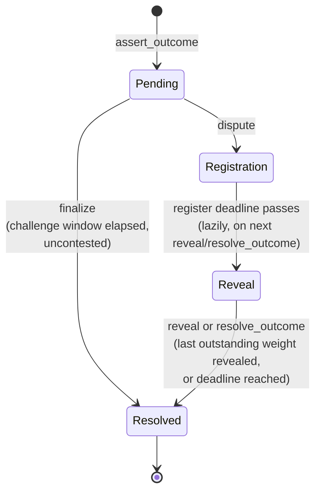

# Contract interface (v2)

Reference for `contracts/tholos-v2`. Source of truth is
`contracts/tholos-v2/src/lib.rs`; this document should be updated alongside
any change to the public interface. See `CONTRACT.md` for v1 (the
fixed-committee-vote contract) and `docs/src/V2_RESOLUTION.md` for the design
rationale behind the stake-weighted scheme documented here.

## Lifecycle

> [!NOTE]
> This section covers the internal state machine. For a higher-level view of how clients interact with this lifecycle, see [Lifecycle at a glance](INTEGRATION.md#lifecycle-at-a-glance) in the integration guide.

Every assertion ends in `Resolved`, reached one of three ways: uncontested
(`finalize` after `challenge_window_secs` with no dispute), a strict majority
of revealed weight locking in favor of one side, or the optimistic default
(`AssertedOutcomeStands`) applying because neither side reached a strict
majority by the time reveal closes, whether that's the reveal deadline or,
if every eligible position revealed early with a split tally, before it. A
`Registration`- or `Reveal`-phase
assertion can also be short-circuited to `Resolved` by `cancel_round` (admin,
emergency-only).

`PhaseV2::Reveal` covers two states that look identical in `phase` but differ
in `terminal_cause`: a majority can lock in (`terminal_cause` set) while
`phase` stays `Reveal`, so other positions can keep revealing to prove
entitlement for settlement. Always read `terminal_cause`, not `phase`, to
learn whether the outcome itself is decided; `phase == Resolved` only tells
you settlement can begin.

## Types

### `PhaseV2`

`Pending`, `Registration`, `Reveal`, or `Resolved`.

### `TerminalCause`

Why an assertion reached its decided outcome. `NotYetDecided` stands in for
`None` — the `contracttype` derive used here doesn't support `Option` of a
custom enum, only of built-in types like `Address`/`bool`.

| Variant | Meaning |
| --- | --- |
| `NotYetDecided` | The outcome hasn't been decided yet. |
| `UncontestedFinalize` | Never disputed within `challenge_window_secs`; closed via `finalize`. The only terminal cause that never goes through registration/reveal. |
| `StrictMajorityFor` | Revealed weight agreeing with the asserted outcome exceeded half of the frozen eligible total `W`. |
| `StrictMajorityAgainst` | Revealed weight disagreeing exceeded half of `W`. |
| `OptimisticTimeout` | Neither side reached a strict majority before reveal closed; the originally asserted outcome stands by default. |
| `AdminCancelled` | Set only by `cancel_round`, on an assertion with no terminal cause yet (`Pending`, `Registration`, or `Reveal` phase). The asserter's bond is refunded (if `Pending`) or every funded position recovers its exact principal, with no forfeiture or reward. |

### `WeightRuleVersion`, `TimeoutDefaultRule`, `PayoutRuleVersion`

Version markers pinned into every `PolicySnapshotV2`, not formulas, so a
future rule can be introduced without reinterpreting already-open assertions
under new math. Today each has exactly one variant: `LinearStakeV1`
(`weight(address) = locked_bond(address)`), `AssertedOutcomeStands`, and
`ProRataV1` respectively.

### `PositionKind`

What kind of position an address holds, and (for a fixed one) which side
it's on:

| Variant | Meaning |
| --- | --- |
| `Fixed(bool)` | The asserter's or disputer's position, created by `dispute`. `true` if it agrees with the asserted outcome; already public, never hidden. |
| `External(BytesN<32>)` | A third party's position, created by `register`. Holds the salted commitment hash to the eventual side, verified by `reveal`. |

### `Position`

One address's stake on one dispute (`(assertion_id, address)`-keyed).
Non-transferable; once funded, only exits through settlement.

| Field | Type | Meaning |
| --- | --- | --- |
| `amount` | `i128` | Total bonded, including any top-ups via repeated `register` calls. |
| `kind` | `PositionKind` | `Fixed` (asserter/disputer) or `External` (third party). |
| `revealed` | `bool` | Whether this position's weight has been counted into `Resolution.agree_weight`/`disagree_weight`. Set automatically for `Fixed` positions when reveal opens; set by `reveal` for `External` ones. |
| `agrees_with_outcome` | `Option<bool>` | Which side this position landed on. `None` until `revealed` is `true`. |
| `settled` | `bool` | Whether `settle` has already run for this position. |

### `Resolution`

Registration- and reveal-phase bookkeeping for one disputed assertion,
separate from `AssertionV2`: `AssertionV2` is claim/parties/policy,
`Resolution` is the mutable per-dispute state. Only exists once `dispute`
has been called (`get_resolution` returns `AssertionNotFound` before that).

| Field | Type | Meaning |
| --- | --- | --- |
| `registration_opened_at` | `u64` | Ledger timestamp `dispute` was called. |
| `registration_deadline` | `u64` | The soft cutoff; pushed out by `anti_snipe_extension_secs` on a qualifying late deposit, capped at `registration_hard_deadline`. |
| `registration_hard_deadline` | `u64` | Fixed at `dispute` time (`registration_opened_at + anti_snipe_hard_max_secs`); no sequence of extensions can push `registration_deadline` past this. |
| `eligible_total` | `i128` | The frozen-at-reveal-cutoff eligible total `W`, maintained incrementally as deposits arrive. |
| `reveal_opened_at` | `u64` | 0 until the lazy `Registration -> Reveal` transition, then that transition's timestamp. |
| `reveal_deadline` | `u64` | 0 until reveal opens, then `reveal_opened_at + reveal_duration_secs`. |
| `agree_weight` | `i128` | Weight revealed agreeing with the asserted outcome, including the asserter's fixed position. |
| `disagree_weight` | `i128` | Weight revealed against it, including the disputer's fixed position. |
| `settled_recipient_weight` | `i128` | Cumulative weight of recipient (reward-eligible) positions already settled; used to detect the last settlement. |
| `settled_reward_total` | `i128` | Cumulative reward (principal excluded) already distributed; used to compute leftover dust on the last settlement. |
| `outstanding_liability` | `i128` | Total credit accrued (via `settle`) but not yet withdrawn. `outstanding_liability + withdrawn_total` never exceeds `eligible_total`. |
| `withdrawn_total` | `i128` | Cumulative amount actually transferred out via `withdraw`. |

`Resolution::revealed_weight()` returns `agree_weight + disagree_weight`
(not stored separately, always derived).

### `VoteCommitmentPreimage`

The exact preimage `reveal` hashes and compares against a position's stored
commitment: `H(canonical_encode("THOLOS_V2_VOTE", network_id,
contract_address, policy_hash, assertion_id, round, voter, choice,
salt_32))`, encoded via `ToXdr` rather than hand-rolled concatenation so the
domain separation is unambiguous by construction. `pub` so
`tools/compute-commitment` can build one off-chain the same way `reveal`
verifies one; this is a Rust visibility detail, not part of the on-chain
interface.

### `PolicySnapshotV2`

Pinned in full onto every `AssertionV2` at creation, never mutated
afterward. A deployment-wide parameter change (were one ever added) would
only affect assertions created after the change.

| Field | Type | Meaning |
| --- | --- | --- |
| `token` | `Address` | The bonding token. |
| `base_bond` | `i128` | Bond every fixed party (asserter, disputer) posts. |
| `challenge_window_secs` | `u64` | How long a `Pending` assertion can be disputed before it's eligible for uncontested `finalize`. |
| `finalize_reward_bps` | `u32` | Basis points (0–1000) of the bond paid to whoever calls `finalize` on an uncontested assertion. |
| `min_resolution_bond` | `i128` | Minimum size of any `register` deposit, first-time or a top-up, unless a position's remaining headroom under `max_position` is smaller. Always equal to `base_bond`, so a third party can't break a tie, or qualify for the anti-snipe extension, for less than the original parties risked. |
| `registration_duration_secs` | `u64` | Base length of the registration window. |
| `anti_snipe_extension_secs` | `u64` | How far a qualifying late deposit pushes the soft registration deadline out. |
| `anti_snipe_hard_max_secs` | `u64` | Absolute cap on the registration window, from `registration_opened_at`. |
| `reveal_duration_secs` | `u64` | Length of the reveal window once it opens. |
| `weight_rule` | `WeightRuleVersion` | Always `LinearStakeV1` today. |
| `timeout_default` | `TimeoutDefaultRule` | Always `AssertedOutcomeStands` today. |
| `payout_rule` | `PayoutRuleVersion` | Always `ProRataV1` today. |
| `max_position` | `i128` | Upper bound on any single position's size, so settlement arithmetic can't overflow. |
| `max_total_weight` | `i128` | Upper bound on the frozen eligible total `W`, for the same reason. Also bounded by `MAX_TOTAL_WEIGHT_TO_POSITION_RATIO * max_position` (ratio = 10) so a single actor must split across at least that many positions to approach the plutocratic threshold. |

### `AssertionV2`

| Field | Type | Meaning |
| --- | --- | --- |
| `id` | `u64` | Assertion id, unique within this deployment only (see `INTEGRATION.md`'s "Assertion identity changes"). |
| `asserter` | `Address` | Who posted the claim. |
| `opened_at` | `u64` | Ledger timestamp `assert_outcome` posted this assertion. |
| `disputer` | `Option<Address>` | Set once `dispute` opens registration; `None` while `Pending`. |
| `outcome` | `bool` | The originally claimed outcome. |
| `phase` | `PhaseV2` | Current lifecycle phase. |
| `policy` | `PolicySnapshotV2` | The policy this assertion is pinned to. |
| `policy_hash` | `BytesN<32>` | Hash of `policy`'s canonical encoding, so a client can confirm which exact policy an assertion is bound to. |
| `terminal_cause` | `TerminalCause` | `NotYetDecided` until locked. Can lock before `phase` reaches `Resolved`; read this field, not `phase`, to know whether the outcome is decided. |
| `final_outcome` | `Option<bool>` | The authoritative resolved outcome. `None` until `terminal_cause` is decided. Stored directly (unlike v1's `Assertion.outcome`, which always keeps the original claim even after a dispute overturns it). |
| `finalizer` | `Option<Address>` | Who called `finalize`. `None` until finalized. |

### `Error`

| Variant | Meaning |
| --- | --- |
| `AlreadyInitialized` | `initialize` called on a contract that's already set up. |
| `NotInitialized` | Called before `initialize`. |
| `AssertionNotFound` | No assertion (or, depending on call, resolution/position) exists for the given id/address. |
| `InvalidBondAmount` | `base_bond` isn't positive, or exceeds `MAX_BOND_AMOUNT`. |
| `InvalidRegistrationDuration` | `registration_duration_secs` is zero or exceeds 7 days. |
| `InvalidRevealDuration` | `reveal_duration_secs` is zero or exceeds 7 days. |
| `InvalidAntiSnipeParams` | `anti_snipe_extension_secs` exceeds `anti_snipe_hard_max_secs`, `anti_snipe_hard_max_secs` is shorter than `registration_duration_secs`, or `anti_snipe_hard_max_secs` exceeds `MAX_ANTI_SNIPE_HARD_MAX_SECS` (29 days). |
| `InvalidMaxPosition` | `max_position` isn't positive, or exceeds `max_total_weight`. |
| `InvalidMaxTotalWeight` | `max_total_weight` isn't positive, or exceeds `MAX_SETTLEMENT_TOTAL_WEIGHT`. |
| `InvalidWeightRatio` | `max_total_weight` exceeds `MAX_TOTAL_WEIGHT_TO_POSITION_RATIO * max_position` (ratio = 10). Raises the minimum capital cost of Sybil-style address splitting. |
| `InvalidChallengeWindow` | `challenge_window_secs` is zero or exceeds 7 days. |
| `InvalidFinalizeReward` | `finalize_reward_bps` exceeds `MAX_FINALIZE_REWARD_BPS` (1000). |
| `NotPending` | Action requires `PhaseV2::Pending` but the assertion isn't. |
| `ChallengeWindowOpen` | `finalize` called before `challenge_window_secs` has elapsed since `opened_at`. |
| `DisputerIsAsserter` | The `disputer` address passed to `dispute` matches the assertion's own asserter. |
| `NotRegistration` | Action requires `PhaseV2::Registration` but the assertion isn't. |
| `CannotRegisterAsFixedParty` | `register` called by the assertion's own asserter or disputer; they already have fixed positions from `dispute`. |
| `InvalidPositionAmount` | `register`'s `amount` isn't positive. |
| `BelowMinimumResolutionBond` | A `register` deposit, first-time or a top-up, is below the effective minimum: `policy.min_resolution_bond`, or the position's remaining headroom under `policy.max_position` if that's smaller. |
| `PositionExceedsMax` | A position's total after this deposit would exceed `policy.max_position`. |
| `EligibleTotalExceedsMax` | The eligible total `W` after this deposit would exceed `policy.max_total_weight`. |
| `CommitmentMismatch` | A top-up's `commitment` doesn't match the one this position was created with. |
| `RegistrationClosed` | `register` called after `registration_deadline` has passed. |
| `RegistrationNotClosed` | `reveal` or `resolve_outcome` called while still `Registration`, before `registration_deadline` has passed. |
| `NotReveal` | `reveal` or `resolve_outcome` called on an assertion that's `Pending` (or, for `reveal`, `Resolved`); it must be `Registration` (past deadline) or `Reveal`. |
| `RevealClosed` | `reveal` called after `reveal_deadline` has passed. |
| `AlreadyRevealed` | This position's weight is already counted — a prior `reveal` call, reveal opening for a `Fixed` position, or a `Fixed` voter calling `reveal` themselves (nothing to reveal). |
| `CommitmentVerificationFailed` | The supplied `(choice, salt)` didn't hash to the stored commitment. |
| `RevealNotClosed` | `resolve_outcome` called while still `Reveal`, before `reveal_deadline` and before all eligible weight has revealed. |
| `NotResolved` | `settle` called before `phase == Resolved`, or on an `UncontestedFinalize` assertion (which never had a `Resolution`/`Position` created). |
| `AlreadySettled` | `settle` called on a position that's already settled. |
| `SettlementArithmeticOverflow` | A checked arithmetic operation in `settle`/`withdraw`/`add_credit` would have overflowed `i128`. Not expected to be reachable given `initialize`'s bounds, but checked since settlement moves real funds. |
| `NoCreditToWithdraw` | `withdraw` called with a 0 credit balance (never settled anything here, or already withdrew it). |
| `ReentrancyGuardActive` | A call that moves tokens (or otherwise acts on funds-adjacent state) was attempted while another was still mid-flight. |
| `Paused` | `assert_outcome` called while `set_paused_v2` has paused new assertions. |
| `NotPaused` | `cancel_round` called while not paused. |
| `RoundAlreadyDecided` | `cancel_round` called on an assertion whose `terminal_cause` is already set, by a real outcome or an earlier cancellation. |

## Functions

### `__constructor(admin)`

The contract's constructor: Soroban invokes it atomically as part of the
same operation that creates the contract instance, not as a separate,
later call. Requires `admin`'s signature and pins it as the admin for
this instance. This closes a front-running gap the
deploy-then-initialize(admin) shape used to have: since deploy and any
follow-up call are otherwise separate transactions, nothing used to stop a
third party from submitting their own `initialize` with their own `admin`
first and claiming the role on an instance someone else paid to deploy.
Because the host runs the constructor only during contract creation, no
later call — including `initialize` below — can invoke it again or hijack
the role at deploy time. From then on, only the current admin can hand the
role to a new address, via `set_admin` (see below).

### `initialize(token, base_bond, challenge_window_secs, finalize_reward_bps, registration_duration_secs, anti_snipe_extension_secs, anti_snipe_hard_max_secs, reveal_duration_secs, max_position, max_total_weight)`

One-time setup, pinning the deployment-wide defaults every future
assertion's `PolicySnapshotV2` is built from. Requires the signature of the
admin `__constructor` fixed at deploy time; this call takes no `admin`
parameter of its own (v1's `initialize` uses the same `__constructor`
pattern; see [CONTRACT.md](CONTRACT.md#initializetoken-bond_amount-challenge_window_secs-resolvers-finalize_reward_bps)).
`base_bond` must be positive and no greater
than `MAX_BOND_AMOUNT` (so `finalize`'s reward-multiply can't overflow).
`challenge_window_secs` and `reveal_duration_secs`/`registration_duration_secs`
must each be non-zero and at most 7 days. `finalize_reward_bps` must be at
most 1000. `anti_snipe_extension_secs` must not exceed
`anti_snipe_hard_max_secs`, and `anti_snipe_hard_max_secs` must be at least
`registration_duration_secs`. `max_total_weight` must be positive and no
greater than `MAX_SETTLEMENT_TOTAL_WEIGHT` (so settlement's
forfeiture-distribution multiply can't overflow); `max_position` must be
positive and no greater than `max_total_weight`. `min_resolution_bond` is
always set equal to `base_bond`. Fails with `AlreadyInitialized` if called
twice, or the matching `Invalid*` error for any out-of-range parameter.

**Residual plutocratic risk:** `initialize` enforces
`max_total_weight <= max_position * MAX_TOTAL_WEIGHT_TO_POSITION_RATIO`
(currently 10), requiring an actor to control at least 10 distinct
positions to dominate the eligible total. This raises the capital cost of
Sybil-style address splitting but does not eliminate plutocracy: a
coalition controlling more than half of the eligible bonded capital can
still determine the result. Fully solving this requires an external
identity system outside this contract's scope; see issue #168 and
`V2_RESOLUTION.md`'s "Non-goals and trust assumption" section.

### `get_policy() -> PolicySnapshotV2`

Read-only lookup of the deployment-wide policy defaults new assertions are
currently pinned from. Fails with `NotInitialized` before `initialize`.

### `set_admin(new_admin)`

Replaces the deployment admin. Requires the *current* admin's signature —
the address `__constructor` originally pinned, or whoever it was last
rotated to. The old admin loses authority the instant this call succeeds;
there's no grace period or two-step handoff. `admin` is pinned by
`__constructor`, not `initialize`, so this succeeds as soon as the
contract has been deployed — even before `initialize` is ever called.
Emits `AdminUpdated { old_admin, new_admin }`.

### `set_paused_v2(paused)`

Blocks or unblocks new `assert_outcome` calls. Requires the stored admin's
signature. Narrower than v1's `set_paused`: an already-active round's
registration, reveal, `resolve_outcome`, `settle`, and `withdraw` all
continue normally even while paused, since blocking them would strand
capital already locked into that round rather than protect it.
`cancel_round` is the mechanism for protecting an already-active round
instead. Emits `PauseUpdated`.

### `get_assertion(id) -> AssertionV2`

Read-only lookup. Fails with `AssertionNotFound` if the id doesn't exist.

### `get_resolution(id) -> Resolution`

Read-only lookup of one assertion's registration/reveal bookkeeping. Fails
with `AssertionNotFound` if it doesn't exist — a `Resolution` is only
created by `dispute`, so an uncontested (`UncontestedFinalize`) or still-
`Pending` assertion never has one.

### `get_position(id, address) -> Position`

Read-only lookup of one address's position on one assertion. Fails with
`AssertionNotFound` if that address has no position there.

### `get_credit(id, address) -> i128`

Read-only lookup of one address's withdrawable credit balance on one
assertion, accrued so far by `settle`. Returns `0` for an address with no
credit record rather than failing — unlike `get_position`, "never settled
anything here" isn't a caller error worth surfacing as one.

### `bump_ttl(id, address)`

Permissionlessly re-extends persistent storage TTL on an assertion's
`AssertionV2` and, if it exists yet, its `Resolution`, plus (if `address`
is given) that address's `Position` and `Credit` entries. Every other write
path already bumps TTL as a side effect, but `Position`/`Credit` keys
aren't enumerable on-chain, so a record nobody happens to touch again
before its own next write (a registered voter who never reveals, or
unclaimed credit) would otherwise only get renewed if that address's own
owner eventually calls `reveal`/`settle`/`withdraw`. Any caller who knows
the relevant `(id, address)` key can call this, no signature required and
no funds move. A no-op, not an error, for any of the four entries that
doesn't exist for this `id`/`address`. Fails only with `AssertionNotFound`
if `id` itself doesn't exist.

### `assert_outcome(asserter, outcome) -> u64`

Posts a bonded claim, the optimistic first stage before any dispute exists.
Transfers `policy.base_bond` from `asserter` to the contract. Requires
`asserter`'s signature. Fails with `Paused` if `set_paused_v2` has paused
new assertions. Returns the new assertion id. Emits `Asserted`.

### `finalize(caller, id) -> bool`

Callable once a `Pending` assertion's `challenge_window_secs` has elapsed
with no dispute. `caller` must authorize the call unconditionally, even
when `finalize_reward_bps` is 0, the same hardening v1 applies, so
`AssertionV2.finalizer` and the `Finalized` event can never be spoofed
regardless of whether a reward is paid.

- When `finalize_reward_bps` is **non-zero**, `caller` receives
  `base_bond * finalize_reward_bps / 10_000` tokens and the asserter
  receives the remainder.
- When `finalize_reward_bps` is **zero**, the full bond returns to the
  asserter. Auth is still required.

Sets `phase = Resolved` and `terminal_cause = UncontestedFinalize`. Returns
the asserted outcome. Fails with `AssertionNotFound`, `NotPending` if the
assertion isn't `Pending`, or `ChallengeWindowOpen` if called too early.
Emits `Finalized`.

### `dispute(disputer, id)`

Disputes a `Pending` assertion, opening the registration phase. Transfers
`base_bond` from `disputer` into escrow, matching the asserter's existing
bond, and creates both parties' `Fixed` positions plus the `Resolution`
record (`eligible_total` starts at `2 * base_bond`). Requires `disputer`'s
signature. Fails with `AssertionNotFound`, `NotPending` if the assertion
isn't `Pending`, or `DisputerIsAsserter` if `disputer` equals the
assertion's own asserter. Emits `Disputed` with the initial
`registration_deadline`.

### `register(voter, id, amount, commitment)`

Funds (or tops up) a third-party position on a `Registration`-phase
assertion, committing to a side without revealing it. Not callable by the
assertion's own asserter or disputer (`CannotRegisterAsFixedParty`) — they
already have fixed positions from `dispute`.

Every deposit, first-time or a top-up, must be at least
`policy.min_resolution_bond`, or the position's remaining headroom under
`policy.max_position` if that's smaller (`BelowMinimumResolutionBond`
otherwise), so a dust-sized top-up can't qualify for the anti-snipe
extension below without representing a real change in position, while a
voter close to the cap can still top off the last of it. A top-up (same voter, same
assertion) aggregates into the existing position and must reuse its
original `commitment` (`CommitmentMismatch` otherwise) — a position's
committed side can never change after funding. Rejects atomically, with no
position or weight created, if the resulting position size would exceed
`policy.max_position` (`PositionExceedsMax`) or the eligible total would
exceed `policy.max_total_weight` (`EligibleTotalExceedsMax`).

A qualifying deposit (landing within `anti_snipe_extension_secs` of the
current deadline) pushes `registration_deadline` out by
`anti_snipe_extension_secs`, capped at `registration_hard_deadline`.

Requires `voter`'s signature. Fails with `AssertionNotFound`,
`NotRegistration` if the assertion isn't in the registration phase,
`RegistrationClosed` if `registration_deadline` has passed, or
`InvalidPositionAmount` if `amount` isn't positive. Emits `PositionFunded`.

### `reveal(voter, id, choice, salt)`

Discloses the side an `External` position committed to during registration,
and verifies it against the stored commitment. Requires `voter`'s
signature.

Lazily transitions the assertion from `Registration` to `Reveal` if called
after `registration_deadline` has passed; fails with
`RegistrationNotClosed` if called too early instead. On success, adds this
position's full weight to `Resolution.agree_weight` (if `choice` matches
the asserted outcome) or `disagree_weight` otherwise, and locks
`terminal_cause`/`final_outcome` if that tips either side past a strict
majority. The assertion stays `Reveal` even after locking so other
positions can keep revealing to prove entitlement for settlement — unless
this reveal was the last outstanding weight, in which case the assertion
closes to `Resolved` in this same call.

A client must read the on-chain phase before submitting a reveal: a
rejected reveal transaction still publishes its `(choice, salt)` preimage
on-chain even though it failed, and a qualifying late deposit may have
extended the deadline.

Fails with `AssertionNotFound`, `RegistrationNotClosed` if called too early,
`NotReveal` if the assertion is `Pending` or `Resolved`, `RevealClosed` if
`reveal_deadline` has passed, `AlreadyRevealed` if this position's weight
is already counted (including a `Fixed` voter, who has nothing to reveal), or
`CommitmentVerificationFailed` if `(choice, salt)` doesn't hash to the
stored commitment. Emits `Revealed`, and `RevealOpened`/`Resolved` if those
transitions happen in the same call.

### `resolve_outcome(id) -> TerminalCause`

Permissionlessly closes a disputed assertion out to `Resolved` once its
outcome can no longer change — most importantly when `reveal_deadline`
passes without every eligible weight revealing, and the degenerate case
where a dispute drew no third-party registrations at all, so nobody ever
has a position to call `reveal` with. Requires no signature: it only
applies a deterministic rule to already-committed weights and elapsed
time, and moves no funds.

Lazily transitions `Registration` to `Reveal` first if
`registration_deadline` has passed; that step alone may already close the
assertion out. Otherwise requires `Reveal` phase; if `reveal_deadline` has
passed or `revealed_weight` has caught up with the frozen eligible total
`W`, locks the outcome (strict majority if reached, `OptimisticTimeout`
otherwise) and moves the assertion to `Resolved`. Idempotent: calling it
again on an already-`Resolved` assertion just returns the already-decided
`terminal_cause`.

Fails with `AssertionNotFound`, `NotReveal` if the assertion is `Pending`,
`RegistrationNotClosed` if still `Registration` before its deadline, or
`RevealNotClosed` if still `Reveal` before its deadline with unrevealed
weight remaining. Emits `RevealOpened` and/or `Resolved` as those
transitions actually happen.

### `settle(id, address) -> i128`

Converts one position's share of a decided outcome into withdrawable
credit. Permissionless: any caller may settle any known position; settling
doesn't move tokens itself (`withdraw` is the separate step that transfers
tokens against the accrued balance).

Requires `phase == Resolved` (`NotResolved` otherwise — including for an
`UncontestedFinalize` assertion, which never had a `Resolution`/`Position`
created). Fails with `AlreadySettled` if `address`'s position has already
settled.

A recipient position (per the assertion's `terminal_cause`: the winning side
for a strict majority, or any revealed position on either side for an
optimistic timeout) recovers its principal plus a pro-rata share of the
forfeited pool: `reward = floor(amount * forfeited_pool / recipient_weight)`.
A losing position, or an unrevealed position under any terminal cause,
recovers nothing. Whichever settlement brings the
recipient side's settled weight up to its full total (the last recipient
position left to settle) also routes any leftover floor-division dust to a
deterministic recipient (the winning asserter or disputer after a
strict-majority result, or the asserter after a timeout default), emitting
`DustCredited` alongside.

Returns this position's own payout (principal plus reward, or 0 if
forfeited; never includes dust routed to a different address in the same
call). Fails with `AssertionNotFound`, `NotResolved`, `AlreadySettled`, or
`SettlementArithmeticOverflow`. Emits `Settled`, and `DustCredited` when
this call happens to close out the recipient side.

### `withdraw(owner, id, destination) -> i128`

Transfers `owner`'s entire withdrawable credit balance on one assertion to
`destination`. Requires `owner`'s authorization. `destination` may be any
address, not necessarily `owner` itself — a token that rejects transfers to
`owner` directly can't permanently strand funds there. Fails with
`AssertionNotFound`, `NoCreditToWithdraw` if the balance is 0 (never
settled anything here, or already withdrew it), or
`SettlementArithmeticOverflow`. Returns the amount
withdrawn. Emits `Withdrawn`.

### `cancel_round(id)`

Cancels an active round before any terminal outcome has locked, refunding
every already-funded position its exact principal, no forfeiture, no
reward, as if the round never happened. Only callable by the current admin
(see `set_admin`), and only while paused (`NotPaused` otherwise) — cancellation
is an emergency measure, requiring a pause first so it can never happen as
a surprise mid-transaction.

Fails outright, rather than treating it as a no-op, with
`RoundAlreadyDecided` if `terminal_cause` is already set, whether by a real
outcome or an earlier cancellation. A still-`Pending` assertion has no
`Resolution`/`Position` records yet, so its single asserter bond is
refunded directly here; a `Registration`- or `Reveal`-phase assertion's
positions instead recover their principal through the normal
`settle`/`withdraw` path afterward (`cancel_round` sets
`terminal_cause = AdminCancelled`, under which every funded position is a
recipient of a zero forfeited pool).

Fails with `AssertionNotFound`, `NotInitialized`, `NotPaused`, or
`RoundAlreadyDecided`. Emits `RoundCancelled`, distinct from `Resolved` (a
real outcome's event), so indexers can always tell the two apart.

## Security notes

`assert_outcome`, `finalize`, `dispute`, and `register` each write their
state change to storage *before* calling the external token contract's
`transfer`, the same checks-effects-interactions ordering v1 uses:
cross-contract calls in Soroban are synchronous, so a non-standard or
malicious `token` contract could otherwise call back into the contract
mid-transfer and observe stale state.

Beyond that state-before-transfer ordering, every function that moves
tokens (`assert_outcome`, `finalize`, `dispute`, `register`, `withdraw`, and
`cancel_round` when it refunds a still-`Pending` assertion's bond directly)
also holds a contract-wide reentrancy mutex (`ReentrancyGuard`) for the
duration of the transfer, via `enter_reentrancy_guard`/
`exit_reentrancy_guard`. `reveal`, `resolve_outcome`, and `settle` never
move tokens themselves, and `cancel_round` doesn't either outside the
`Pending` case, but all three still check the guard at
entry (`check_reentrancy_guard`), since all four can act on a position's
weight, credit, or terminal state — state the guard exists specifically to
keep provisional until its funding transfer actually completes. A call
attempted while the guard is already held fails with
`ReentrancyGuardActive`. `test_reentrancy_guard_blocks_calls_while_held` in
`contracts/tholos-v2/src/test.rs` exercises this directly.

`finalize` requires `caller.require_auth()` unconditionally, regardless of
whether `finalize_reward_bps` is zero — the same reasoning as v1's
`finalize`: without it, a zero-bps deployment would accept any address as
`caller` with no authorization, permanently writing an unverifiable
identity into `AssertionV2.finalizer` and the `Finalized` event. No funds
are at risk in that case, but the audit trail would be spoofable.

Settlement arithmetic (`settle`, `withdraw`, `add_credit`) uses checked
`i128` operations throughout rather than assuming `initialize`'s bounds
(`MAX_BOND_AMOUNT`, `MAX_SETTLEMENT_TOTAL_WEIGHT`) make overflow
unreachable, returning `SettlementArithmeticOverflow` rather than
wrapping or panicking, since settlement moves real funds.

### Persistent storage TTL

Every write to an assertion's, resolution's, position's, or credit
balance's persistent storage entry (via the shared `set_assertion`,
`set_resolution`, `set_position`, and `add_credit` helpers) extends its TTL
to cover that specific assertion's own worst-case active-phase horizon:
`anti_snipe_hard_max_secs + reveal_duration_secs`, plus a fixed 7-day
settlement/withdrawal grace period on top, converted from seconds to
ledgers and floored at 30 days (`INSTANCE_BUMP_AMOUNT`, the flat bump v1
uses). A deployment with a short `anti_snipe_hard_max_secs` gets the same
30-day floor v1-style deployments always had; a deployment configured with
a longer one gets a proportionally longer bump, computed fresh from that
assertion's own pinned `PolicySnapshotV2` on every write, so its records
can't outlive their own TTL mid-round regardless of how the deployment is
tuned. `test_dispute_sizes_resolution_and_position_ttl_from_policy_when_larger_than_instance_bump`
in `contracts/tholos-v2/src/test.rs` verifies the sized case exceeds the
floor; `test_assertion_storage_ttl_is_extended_on_finalize` verifies the
floor case matches it exactly.

Because `Position` and `Credit` keys aren't enumerable on-chain (the design
deliberately avoids an unbounded voter vector), a record nobody happens to
touch again before its own next write, most commonly a registered voter
who never reveals, or credit nobody withdraws promptly, would otherwise
only get its TTL renewed if that address's own owner eventually calls
`reveal`/`settle`/`withdraw`. `bump_ttl(id, address)` (below) lets anyone
who knows the relevant `(id, address)` key, an off-chain indexer, the
address's own owner, or anyone else with an interest in the record staying
live, renew it permissionlessly without needing to be that owner or move
any funds, closing the same gap v1 doesn't have (v1 has exactly one
long-lived record type per assertion, kept alive by that same assertion's
own frequent writes).

## Events

Each state-changing function emits a corresponding event, topic-indexed by
assertion `id` where applicable, so off-chain indexers can follow an
assertion's history without polling `get_assertion`:

| Event | Emitted by | Fields |
| --- | --- | --- |
| `Asserted` | `assert_outcome` | `id`, `asserter`, `outcome` |
| `Disputed` | `dispute` | `id`, `disputer`, `registration_deadline` |
| `PositionFunded` | `register` | `id`, `voter`, `amount` (position's new total), `eligible_total` (running `W`) |
| `RevealOpened` | `reveal`, `resolve_outcome` (on the lazy `Registration -> Reveal` transition) | `id`, `reveal_deadline` |
| `Revealed` | `reveal` | `id`, `voter`, `choice` |
| `Resolved` | `reveal`, `resolve_outcome` (once the assertion closes to `Resolved`) | `id`, `terminal_cause`, `final_outcome` |
| `Settled` | `settle` | `id`, `address`, `payout` (principal plus reward, or 0; excludes any dust routed in the same call) |
| `DustCredited` | `settle`, at most once per assertion, when that call closes out the recipient side with nonzero leftover dust | `id`, `address` (the deterministic dust recipient), `amount` |
| `Withdrawn` | `withdraw` | `id`, `owner`, `destination`, `amount` |
| `PauseUpdated` | `set_paused_v2` | `paused` |
| `RoundCancelled` | `cancel_round` | `id` |
| `Finalized` | `finalize` | `id`, `outcome`, `finalizer` (`Address`), `reward` |

`Finalized.finalizer` is always the address that called `finalize` — auth
is required unconditionally, so this value is always verified regardless
of whether `finalize_reward_bps` is non-zero, the same guarantee v1's
`Finalized` event carries.

## Known gaps

- **No top-up path for fixed positions.** The asserter's and disputer's
  `Fixed` positions are sized once, at `dispute` time, to `base_bond`; a
  way for them to add to those positions after the fact is tracked
  separately from the work this document covers.
- **No canonical v2 deployment, SDK bindings, or `demos/freelance-escrow`
  integration yet.** See `docs/src/INTEGRATION.md`'s "Tholos v2 > Known
  gaps" for the current state of each.
